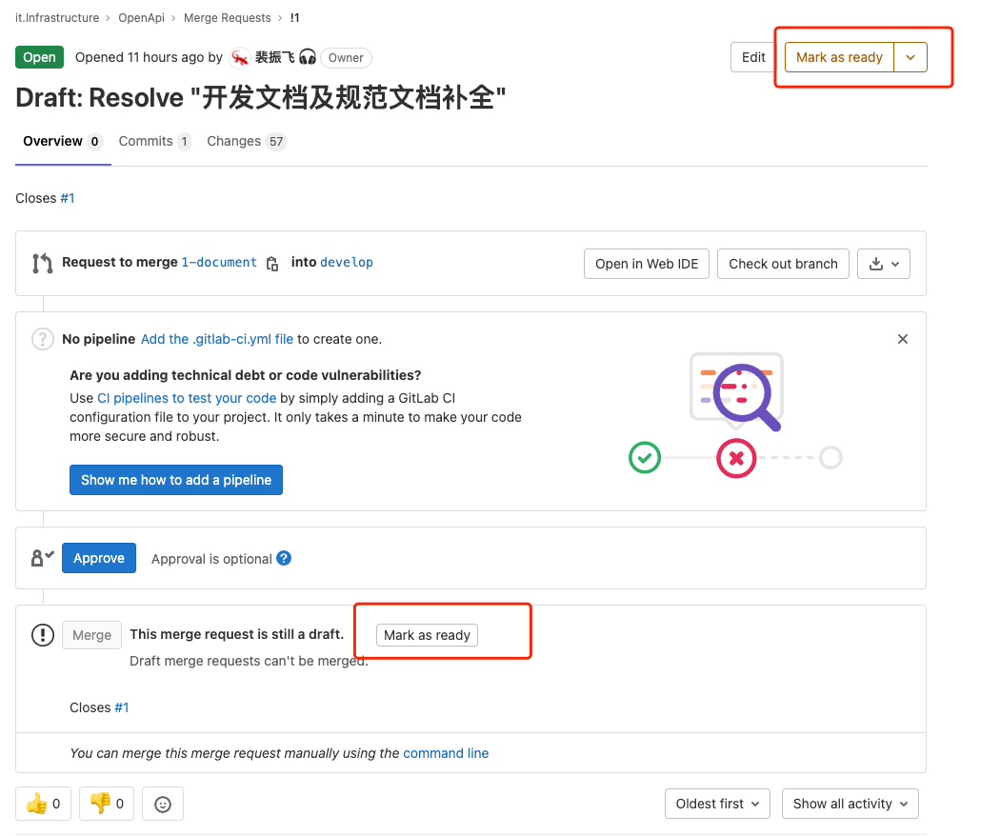

************
Gitlab 使用
************

分支使用
========

代码仓库有 ``master`` 和 ``develop`` 两分支，且均为保护分支，任何人都不允许直接推送代码到这两个分支，*merge* 权限只有 *maintainer* 允许。

.. note:: ``master`` 是代码的稳定版本，适用于生产环境，此分支只允许从 ``develop`` 分支合并，请勿从其他自建 ``feather`` 分支合并代码到此分支。

.. note:: ``develop`` 是开发测试版本，适用于调试代码，其他 ``feather`` 分支请合并到此分支。创建新分支时，请基于当前 ``develop`` 最新代码检出。

开发流程
========

创建 ISSUE
-------------

``issue`` 是所有开发工作的起始，也是所有相关事件的核心。创建 issue 时请根据表单尽量填写详细信息，其他成员或有疑问，可将 ``issue`` 当做帖子一样讨论。

创建分支
---------

gitlab 中分支 (branch) 和合并请求 (pull request) 均可基于 ``issue`` 创建。如下图所示，创建远程分支和 PR

本地获取远程分支
-----------------

打开本地命令行，执行如下命令

.. code-block:: shell

    git fetch
    git checkout <branch>

提交代码
--------

提交代码可以不推荐使用命令行，建议使用 pycharm 自带 GUI 工具

指派审核人
----------

代码提交到远程分支后，如果需要合并，务必点击按钮 ``Mark as Ready``，否则指派的合并人不会收到通知。合并请求人有义务对代码进行审核和提出质疑，审核通过后的代码，方可合并。

